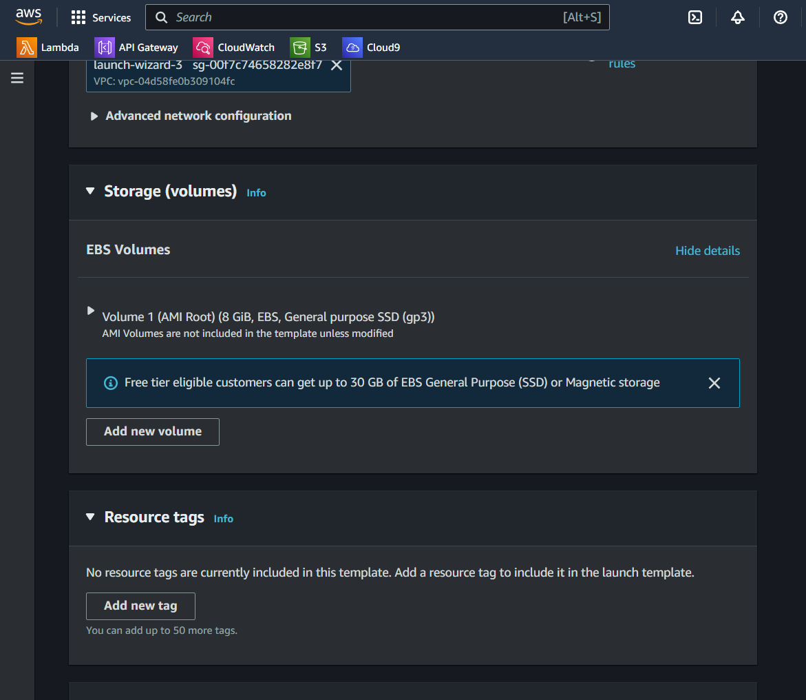
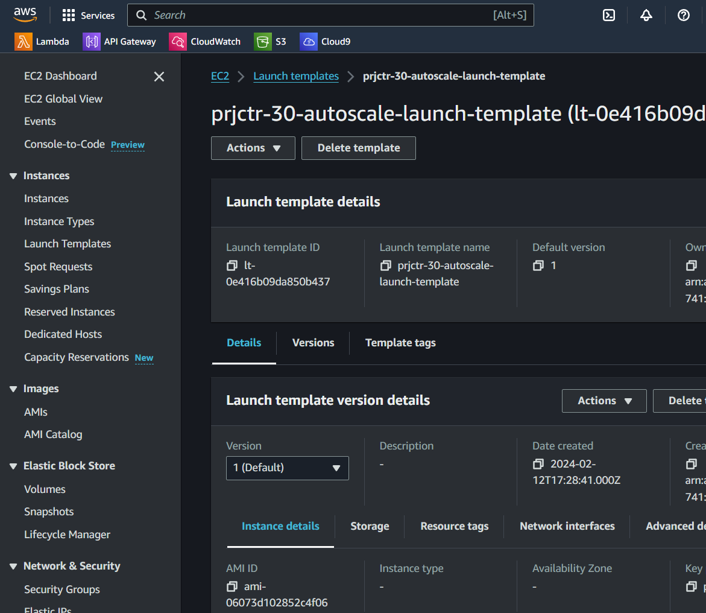
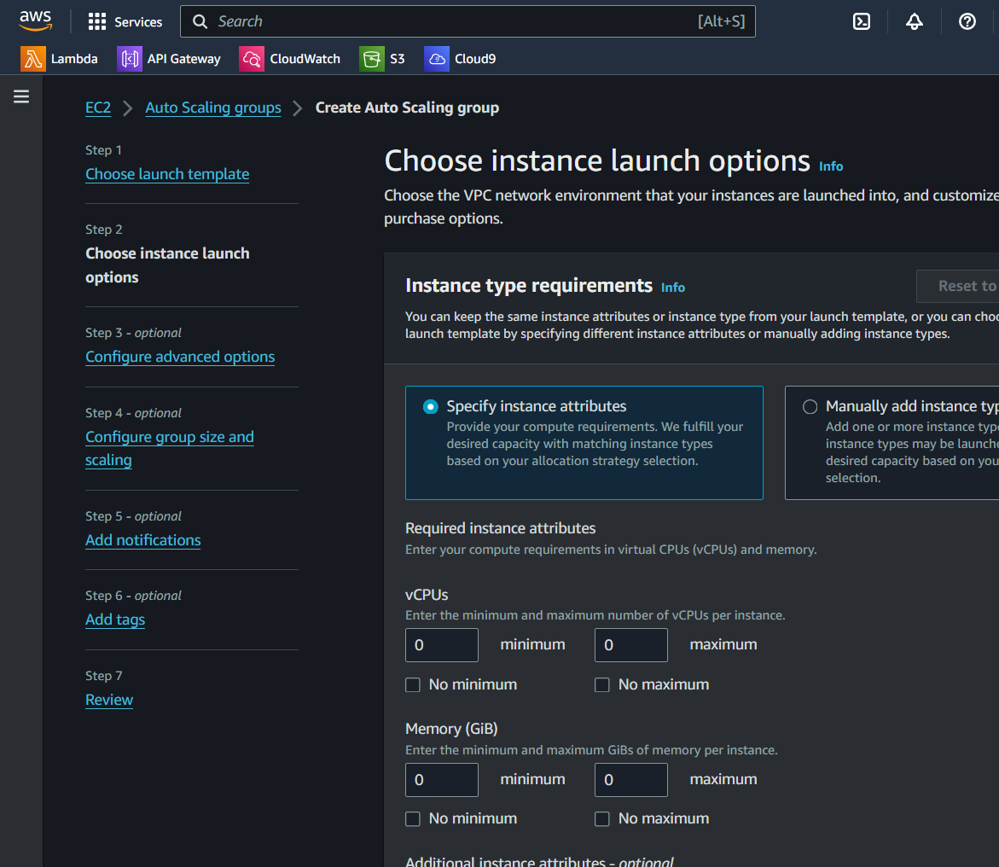
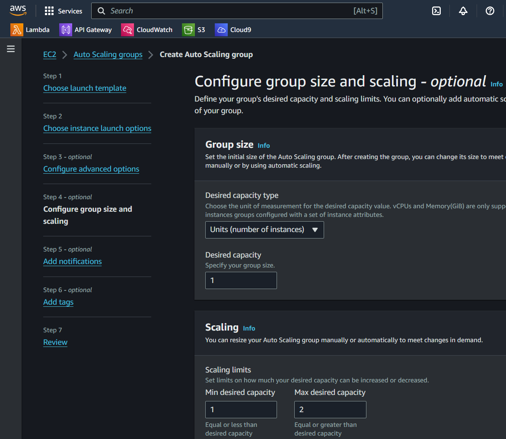
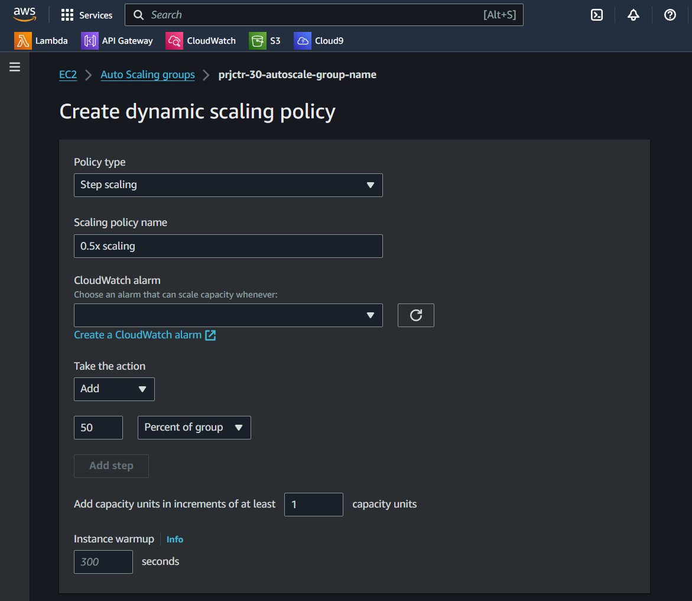
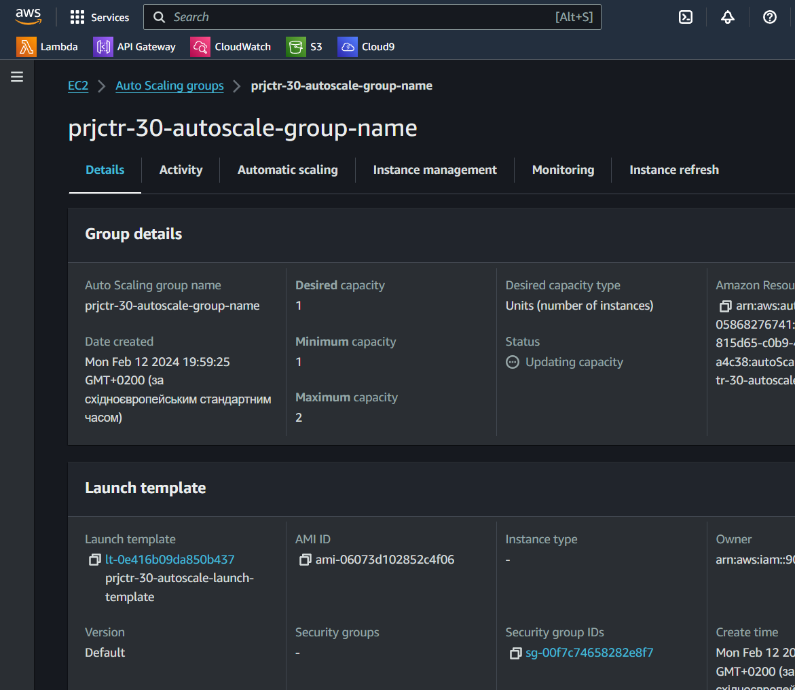

# AWS Auto Scaling Group with On-Demand and Spot Instances

## Overview
This project outlines how to set up an AWS Auto Scaling group designed to start with one on-demand instance and scale out with spot instances based on defined metrics. The scaling policies focus on average CPU usage and request volume, allowing for non-linear scaling to efficiently manage resource allocation and cost.

## Prerequisites
- An AWS account
- Basic knowledge of AWS EC2, Auto Scaling Groups, and Launch Templates

## Step-by-Step Guide

### Step 1: Create Launch Template
1. Navigate to the EC2 dashboard in the AWS Management Console.
2. Select "Launch Templates" and click "Create launch template."
3. Configure the template with the desired AMI, instance type, and additional settings.

   
   

### Step 2: Create Auto Scaling Group
1. Go to the EC2 service page and select "Auto Scaling Groups" from the navigation pane.
2. Start the creation process and select the previously created launch template.
3. Within the Auto Scaling group creation workflow, configure the mixed instances policy to include both on-demand and spot instances.
4. Specify the desired proportions and preferences for on-demand and spot instances.

   

### Step 3: Set up Scaling Policies
- **Average CPU Usage:**
  1. Create a scaling policy based on the average CPU usage.
  2. Define thresholds for scaling out (adding instances) and scaling in (removing instances).

     

- **Request Volume (Non-Linear Growth):**
  1. Implement a step scaling or target tracking policy based on request metrics from CloudWatch (assuming integration with an Application Load Balancer or another request-counting mechanism).
  2. Configure the policy to allow for non-linear growth, such as adding a higher percentage of instances as request volume increases.

     

### Step 4: Review and Launch
1. Review all configurations for your Auto Scaling group and launch it.
2. Monitor the Auto Scaling group and adjust policies as necessary based on performance and cost efficiency.

   

## Usage
Once set up, the Auto Scaling group will automatically adjust its size based on the defined criteria, ensuring that your application can handle varying loads efficiently while optimizing costs.
